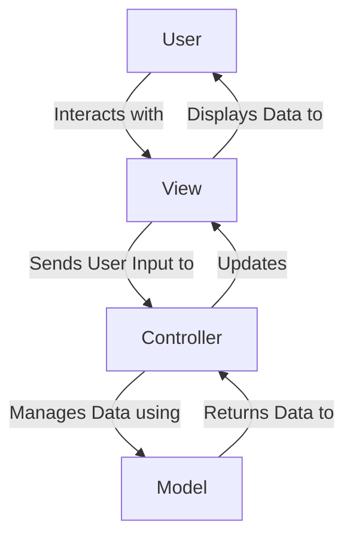

# Mail Management System (Pal Mail) 🎓

## Overview ✍
The **Mail Management System (Pal Mail)** is a mobile application designed to streamline the process of managing incoming and outgoing mail within organizations. It provides features for tracking, categorizing, and archiving mail, ensuring efficient communication between organizations and their users.

The application is built using **Flutter** for the frontend and **Laravel** for the backend, following the **MVC (Model-View-Controller)** design pattern to ensure a clean and maintainable codebase.

## 📌 MVC Design Pattern
The project follows the **MVC (Model-View-Controller)** design pattern to separate the application into three main components:

### 1. Model:
- **Responsibility:** Represents the data and business logic of the application.
- **Tasks:**
  - Manages data (e.g., fetching, updating, or deleting data from the database).
  - Contains the core logic of the application (e.g., validation rules, calculations).
<!-- - **Example:** In the Mail Management System, the Model handles operations like retrieving mail details or updating the status of a mail. -->

### 2. View:
- **Responsibility:** Displays the data to the user and interacts with them.
- **Tasks:**
  - Presents data received from the Controller to the user.
  - Does not contain any business logic or data processing.
<!-- - **Example:** In the Mail Management System, the View displays a list of mails or the details of a specific mail. -->

### 3. Controller:
- **Responsibility:** Acts as the mediator between the Model and the View.
- **Tasks:**
  - Receives user input (e.g., button clicks, form submissions).
  - Communicates with the Model to perform actions (e.g., fetch or update data).
  - Sends data to the View for display.
<!-- - **Example:** In the Mail Management System, the Controller handles a request to view a specific mail by fetching the data from the Model and sending it to the View. -->

## 📌 How the MVC Pattern Works in Pal Mail

## 📌 Technologies Used
- **Frontend:** Flutter (Dart)
- **Backend:** Laravel (PHP)
- **Database:** SQL Server
- **Tools:** VS Code, Postman, Git

## 📌 Features
- **Mail Management:**
  - Add, modify, delete, and archive mail.
  - Track the status of mail (e.g., pending, in progress, completed).
  - Add tags to organize mail.
- **User Roles:**
  - **Admin:** Manage users and system settings.
  - **Editor:** Manage mail and tags.
  - **User:** Submit and track mail requests.
- **Search and Filter:**
  - Search for mail using keywords or filters (e.g., tags, status).
- **User-Friendly Interface:**
  - Intuitive design for easy navigation.
  - Support for multiple languages (Arabic and English).